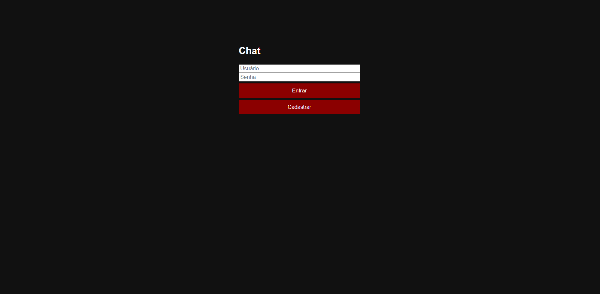
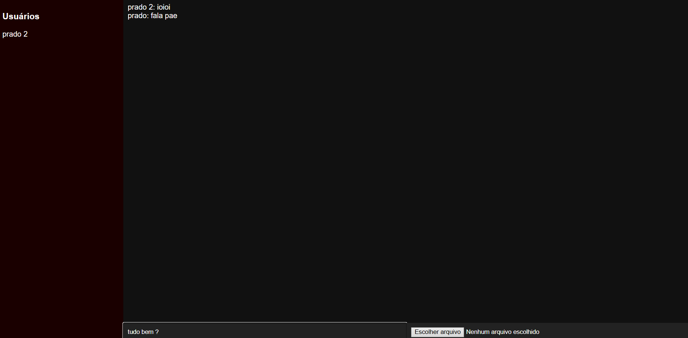

# 💬 Chatzinho

Um chat em tempo real desenvolvido com **Node.js**, **Express** e **Socket.io**, focado em simplicidade, desempenho e comunicação instantânea.

---

## 🌐 Demo

👉 Acesse o projeto:  
https://chatzinho.onrender.com

---

## 📸 Preview

### 🔐 Login
<p align="center">
  
</p>

### 💬 Chat em tempo real
<p align="center">
  
</p>

---

## ⚡ Funcionalidades

- 🔐 Cadastro e login de usuários
- 💬 Mensagens privadas em tempo real
- ⚡ Comunicação via Socket.io
- 🖼️ Upload de imagens e arquivos
- 📜 Histórico de conversas
- 🌍 Aplicação online (Render)

---

## 🛠️ Tecnologias

- Node.js
- Express
- Socket.io
- HTML5
- CSS3
- JavaScript

---

## 📁 Estrutura do projeto

chat-app/
│
├── server.js
├── database.json
├── package.json
│
├── public/
│ ├── index.html
│ ├── chat.html
│ ├── app.js
│ └── style.css
│
├── screenshots/
│ ├── tela1.png
│ └── tela2.png
│
└── uploads/


---

## 🚀 Como rodar localmente

```bash
git clone https://github.com/gabriel-prado16/chatzinho.git
cd chat-app
npm install
node server.js

Depois acesse:

http://localhost:3000
